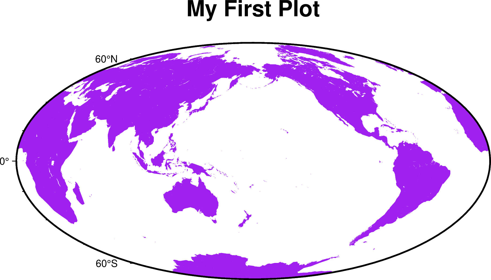

## 绘制第一张图

1.  启动bash，运行GMT
    
    进入工作目录 `G:\MyProgram\gmt\1` ，右键 Git Bash Here , 进入 bash  输入 `git` ， 你将看到 GMT 的欢迎界面信息，类似于：
    ```
    sheng@cslaptop MINGW64 /g/MyProgram/gmt/1
    $ git
    usage: git [-v | --version] [-h | --help] [-C <path>] [-c <name>=<value>]
            [--exec-path[=<path>]] [--html-path] [--man-path] [--info-path]
            [-p | --paginate | -P | --no-pager] [--no-replace-objects] [--bare]
            [--git-dir=<path>] [--work-tree=<path>] [--namespace=<name>]
            [--super-prefix=<path>] [--config-env=<name>=<envvar>]
            <command> [<args>]

    These are common Git commands used in various situations:

    start a working area (see also: git help tutorial)
    clone     Clone a repository into a new directory
    init      Create an empty Git repository or reinitialize an existing one

    work on the current change (see also: git help everyday)
    add       Add file contents to the index
    mv        Move or rename a file, a directory, or a symlink
    restore   Restore working tree files
    rm        Remove files from the working tree and from the index

    examine the history and state (see also: git help revisions)
    bisect    Use binary search to find the commit that introduced a bug
    diff      Show changes between commits, commit and working tree, etc
    grep      Print lines matching a pattern
    log       Show commit logs
    show      Show various types of objects
    status    Show the working tree status

    grow, mark and tweak your common history
    branch    List, create, or delete branches
    commit    Record changes to the repository
    merge     Join two or more development histories together
    rebase    Reapply commits on top of another base tip
    reset     Reset current HEAD to the specified state
    switch    Switch branches
    tag       Create, list, delete or verify a tag object signed with GPG

    collaborate (see also: git help workflows)
    fetch     Download objects and refs from another repository
    pull      Fetch from and integrate with another repository or a local branch
    push      Update remote refs along with associated objects

    'git help -a' and 'git help -g' list available subcommands and some
    concept guides. See 'git help <command>' or 'git help <concept>'
    to read about a specific subcommand or concept.
    See 'git help git' for an overview of the system.

    sheng@cslaptop MINGW64 /g/MyProgram/gmt/1
    $

    ```


2.  生成脚本模板
    继续在bash中敲入:
    ```
    gmt --new-script > myplot.sh
    ```
    该命令会在当前目录生成一个 GMT 模板脚本，并保存到 Bash 脚本文件 myplot.sh 中。

3. 查看并编辑脚本文件
    Bash 脚本文件是一个纯文本文件，可以直接用文本编辑器打开。
    采用 Notepad++ 双击打开 ``myplot.sh`` 后会看到如下内容:
    ```
    #!/usr/bin/env bash
    # GMT modern mode bash template
    # Date:    2019-09-10T00:44:39
    # User:    seisman
    # Purpose: Purpose of this script
    export GMT_SESSION_NAME=$$  # Set a unique session name
    gmt begin figurename
        # Place modern session commands here
    gmt end show
    ```
    其中，以 # 开头的行尾注释行，export GMT_SESSION_NAME=$$ 这一行属于高级用法，可以忽略。因而核心内容只有两行，即 gmt begin 和 gmt end 这两行。
    编辑脚本，在 gmt begin 和 gmt end 中间添加 GMT 命令，将脚本修改如下:
    ```
    #!/usr/bin/env bash
    # GMT modern mode bash template
    # Date:    2019-09-10T00:44:39
    # User:    seisman
    # Purpose: Purpose of this script
    export GMT_SESSION_NAME=$$  # Set a unique session name
    gmt begin figurename
        gmt coast -Rg -JH15c -Gpurple -Baf -B+t"My First Plot"
    gmt end show
    ```
    编辑完成后记得保存文件。

4. 执行脚本以绘图

    回到bash，运行 Bash 脚本:
    ```
    bash myplot.sh
    ```
    待脚本执行完成后，工作目录  `G:\MyProgram\gmt\1` 中将生成 PDF 格式的图片文件，双击打开将看到如下图所示的图片。

    

以上就是运行 GMT 脚本的基本流程，即：

- 生成脚本模板
- 编辑脚本，添加 GMT 绘图命令
- 运行脚本并查看绘图效果


- 参考: https://docs.gmt-china.org/6.4/tutorial/get-started/linux/


## GMT 命令初探

GMT 在绘图时，总是以 begin 开始，并以 end 结束。所有的绘图命令都放在 begin 与 end 之间，而非绘图命令可以放在任何地方。

在前一节中我们使用  `gmt --new-script > myplot.sh` 命令生成一个绘图模板。忽略掉绘图模板中的注释语句，一个最最基本的 GMT 绘图脚本的模板是:

```
gmt begin
#
# 其它命令，包括 GMT 绘图命令、数据处理命令以及其它 UNIX 命令
#
gmt end show
```

绘图时我们通常需要指定图片文件名和图片格式，因而更实用的绘图脚本模板为:

```
gmt begin FigureName pdf
#
# 其它命令，包括 GMT 绘图命令、数据处理命令以及其它 UNIX 命令
#
gmt end show
```

- FigureName 指定了要生成的图片文件名，你可以指定任意文件名，但最好避免在文件名中使用特殊符号和空格。若不给定文件名，则默认文件名为 gmtsession
- 紧跟在图片文件名后的 pdf 指定了要生成的图片格式（若不指定格式，则默认图片格式为 PDF）。GMT 支持多种图片格式，pdf、ps、eps、jpg、png、bmp 等等。若想要一次性生成多种格式的图片，则可以使用逗号将多种格式连接起来，如 pdf,png 会同时生成 PDF 和 PNG 格式的图片
- gmt end 后面加上 show，则 GMT 会在绘图完成后，使用系统自带的阅读器软件自动打开生成的图片文件，供用户预览绘图效果

## 输出pdf和png格式图片

在 GMT 绘图脚本模板的基础上，向 begin 和 end 语句中间加入正确的 GMT 绘图命令，即可实现用 GMT 绘图。

下面的脚本使用 coast 绘制了一张全球地图。执行该脚本，会生成文件名为 GlobalMap、格式为 PNG 和 PDF 的图片文件，并且 GMT 会在绘图结束后自动打开生成的图片文件。

```
gmt begin GlobalMap pdf,png
    gmt coast -Rg -JH15c -Gpurple -Baf -B+t"My First Plot"
gmt end show
```


## GMT 命令格式

一个 GMT 命令通常由 gmt + 模块名 + 选项 + 参数 构成。比如上面的例子中:

```
gmt coast -Rg -JH15c -Gpurple -Baf -B+t"My First Plot"
```

-   所有的 GMT 命令都需要以 **gmt** 开头
-   **coast** 是模块名，这个模块可以用于绘制海岸线
-   **-R**、**-J**、**-G**、**-B**\ 等以 **-** 开头的是模块的选项
-   **-Baf** 中 **af** 是 **-B** 选项的参数
-   **-B+t**\ "My First Plot" 中 **+t** 为 **-B** 的
    子选项，"My First Plot" 则是子选项 **+t** 的参数

关于 GMT 命令的几点说明：

-   若模块名以 **gmt** 开头，则模块名中的 **gmt** 可省略。
    比如 **gmt gmtset xxx xxx** 可简写为 **gmt set xxx xxx**
-   模块名、选项等均区分大小写
-   选项以 **-** 开头，后接\ **单个字符**\ 表示某个选项，字符后接选项的参数以及子选项
-   子选项以 **+** 开头，后接\ **单个字符**\ 以及子选项的参数
-   不以 **-** 开头的参数，通常都会被当做文件，GMT 会尝试去读取
-   各选项间以空格分隔，选项内部不能有空格。选项内部的字符串中若存在空格，
    在 Bash 下可以使用单引号或双引号括起来。


- 参考: https://docs.gmt-china.org/6.4/tutorial/commands

