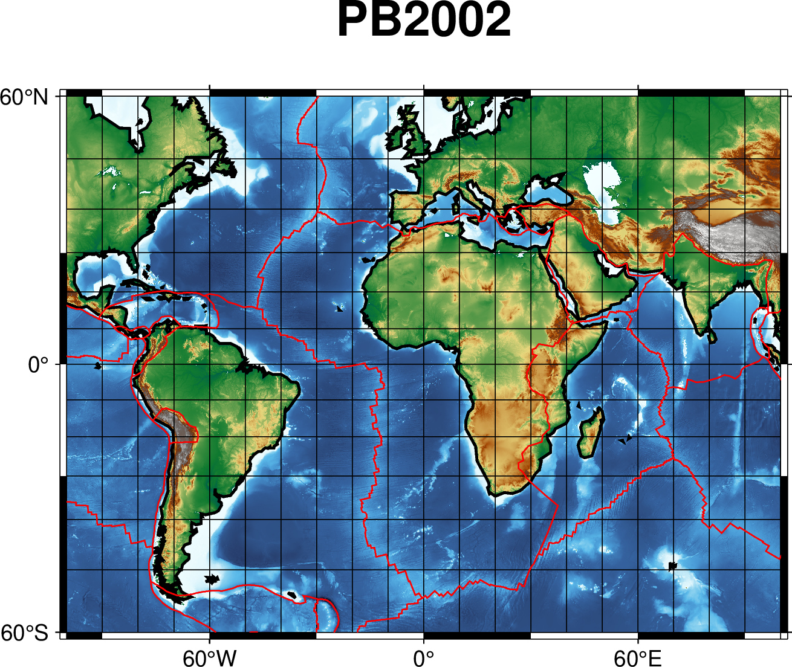

## grdimage绘制全球地形起伏数据

**earth_relief: 全球地形起伏数据**

数据简介
earth_relief 数据是 GMT 提供的全球地形起伏数据，其包含了全球陆地和洋底的高程数据。原始数据来源于公开数据，GMT 经过了一些预处理，提供了不同分辨率和不同配准方式的网格数据，以满足用户的不同需求。earth_relief 数据默认使用 GMT 内置 CPT 文件 geo。


GMT数据服务器目前在全球范围内有多个镜像。详细的镜像列表见 https://www.generic-mapping-tools.org/mirrors 页面。 对于国内用户，建议直接使用中科大LUG提供的国内镜像。修改方式为:

```
gmt set GMT_DATA_SERVER https://mirrors.ustc.edu.cn/gmtdata
```

## 完整的绘图脚本  
如下:
```
#!/usr/bin/env bash
# GMT modern mode bash template
# Date:    2019-09-10T00:44:39
# User:    seisman
# Purpose: Purpose of this script
export GMT_SESSION_NAME=$$  # Set a unique session name

gmt begin grdimage png
    gmt grdimage @earth_relief_04m -JM10c -R-100/100/-60/60 -Ba60f30g10 -B+t"PB2002" -Cgeo
    gmt coast -W1/1p,black -A1000
    gmt plot PB2002_boundaries.dig.txt -W0.5p,red
gmt end show
```




- 参考: https://docs.gmt-china.org/6.4/module/grdimage/

