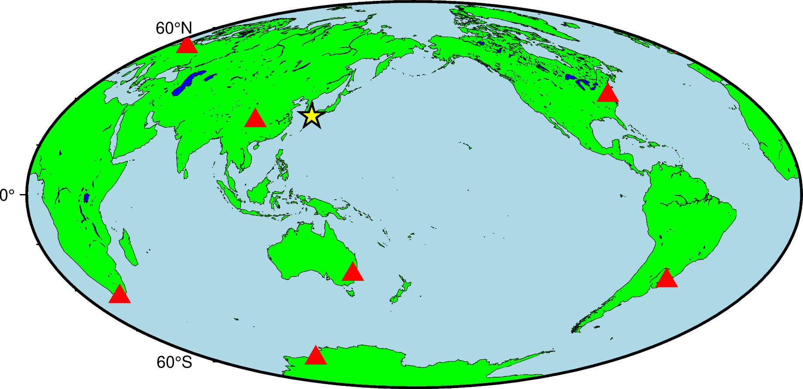

## plot画符号


要绘制符号，必须要有符号的经纬度坐标。 

以下面坐标点为例 :  

|    经度    |     纬度     |
| ---------- |  ----------  |

```
104.39   29.90
 13.14   52.50
 19.99  -34.52
-77.15   38.89 
-52.47  -31.62
150.36  -33.79
 76.22  -69.22
```

下面的例子中，我们首先使用 UNIX 下的 cat 命令将数据写入到文件 stations.txt 中，然后使用 coast 模块绘制了一张底图，并使用 plot 模块绘制输入文件 stations.txt 中的数据。  

下面的几行代码的作用是将两个 EOF 中间的三行数据保存到文件 stations.txt 中:
```
cat > stations.txt << EOF
104.39   29.90
 13.14   52.50
 19.99  -34.52
-77.15   38.89 
-52.47  -31.62
150.36  -33.79
 76.22  -69.22
EOF
```

下面的脚本中，采用 plot 模块绘制 stations.txt 给出的坐标点，并给 plot 添加了 `-St0.5c 选项，绘制三角形符号，外接圆直径为0.5c，`G` 设置符号的填充色为red

```
gmt begin figure1 png,pdf
    gmt coast -JH15c -Rg -Baf -W0.1p -Cblue -Ggreen -Slightblue
    gmt plot -St0.5c stations.txt -Gred
gmt end show
```

可以采用plot继续绘制坐标点：

```
cat > epicenter.txt << EOF
130.72 32.78
EOF

gmt begin figure1 png,pdf
    gmt coast -JH15c -Rg -Baf -W0.1p -Cblue -Ggreen -Slightblue
    gmt plot -St0.5c stations.txt -Gred
    gmt plot -Sa0.5c epicenter.txt -Gyellow -W1p,black
gmt end show
```

完整的绘图脚本如下:
```
#!/usr/bin/env bash
# GMT modern mode bash template
# Date:    2019-09-10T00:44:39
# User:    seisman
# Purpose: Purpose of this script
export GMT_SESSION_NAME=$$  # Set a unique session name

cat > stations.txt << EOF
104.39   29.90
 13.14   52.50
 19.99  -34.52
-77.15   38.89 
-52.47  -31.62
150.36  -33.79
 76.22  -69.22
EOF

cat > epicenter.txt << EOF
130.72 32.78
EOF

gmt begin figure1 png,pdf
    gmt coast -JH15c -Rg -Baf -W0.1p -Cblue -Ggreen -Slightblue
    gmt plot -St0.5c stations.txt -Gred
    gmt plot -Sa0.5c epicenter.txt -Gyellow -W1p,black
gmt end show
```



+ -S  选项相对复杂，与不同的选项连用，或者后面接不同的参数，所需要的输入数据的格式也不同。不管是什么符号，至少都需要给定符号的位置，即X和Y是必须的:

```
X   Y
```


- 参考: https://docs.gmt-china.org/6.4/module/plot/

